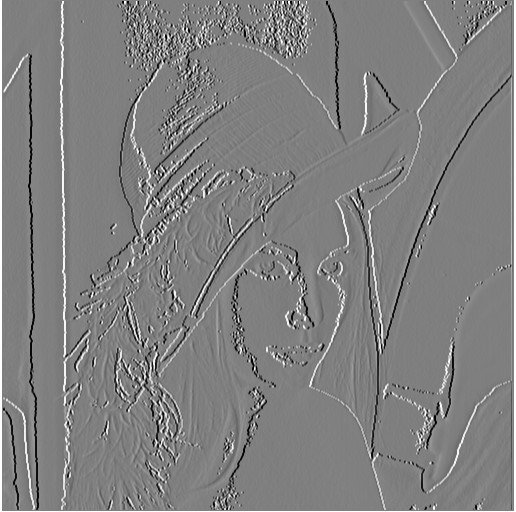

# Sobel Edge Detection in C
This is small image processing project which can read&amp;write pgm images in C language and applies sobel edge detection on them.

Github readme can't show the pgm images so i converted pgm to jpg for sampling.

## Input Image

  

## Gradient X

  

## Gradient Y

  

## Gradient 

  

